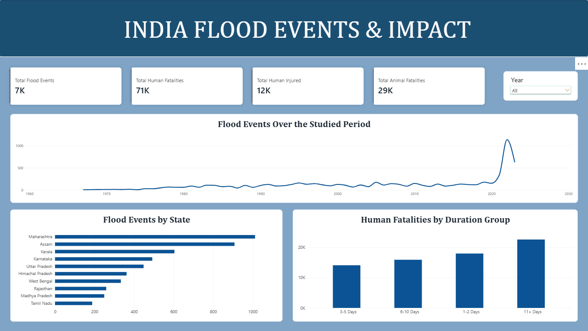
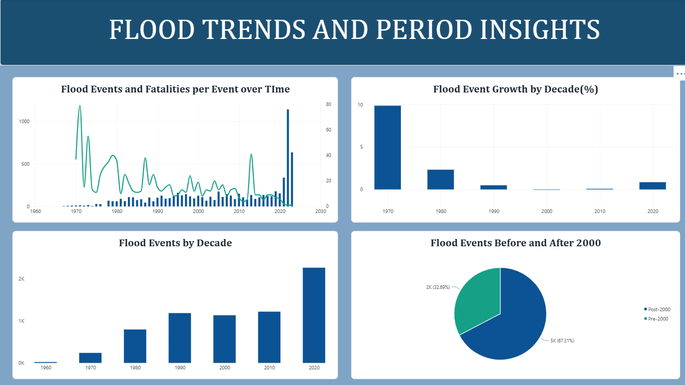

# India Flood Events & Impact Analysis – Power BI

## Project Overview

This Power BI project analyzes flood events in India to identify trends in flood frequency, severity, geographical distribution, and their impact on people and affected areas over time.

## Objectives

- Analyze flood events and severity across different years.
- Identify trends in flood frequency and affected areas.
- Analyze human fatalities, injuries, and displacement caused by floods.
- Compare flood impact across different states.
- Understand changes in flood events and their impact over time.

## Dataset

The project uses the **India Flood Inventory** dataset containing information about flood location, severity, area affected, human fatalities, human injuries, human displacement, and animal fatalities.

## Data Cleaning

Data preparation was performed using **Power Query** in Power BI.

- Removed unnecessary and unnamed columns.
- Removed blank rows and unwanted characters.
- Cleaned and standardized location and district information.
- Removed unnecessary time portions from duration fields.
- Handled missing and inconsistent values.

## Tools & Technologies

- Power BI
- Power Query
- DAX
- Data Visualization
- Data Cleaning & Transformation

## Dashboard Pages

### 1. Overview

Provides a high-level summary of India's flood events, affected areas, severity, and overall impact.



### 2. Flood Trends

Analyzes flood events and their changes over time, including trends in flood frequency and affected areas.



### 3. Flood Analysis

Provides detailed analysis of flood severity, affected areas, and the overall impact of flood events.


### 4. State Analysis

Compares flood events and their impact across different states in India.


## Key Insights

- Examined changes in flood events over time.
- Analyzed the relationship between flood severity and affected areas.
- Evaluated human fatalities, injuries, and displacement.
- Compared flood impact across different states.
- Identified geographical and time-based patterns in flood events.

## Project Structure

```text
India-Flood-Events-PowerBI/
│
├── README.md
├── India_Flood_Events_Impact_Analysis.pbix
│
└── Screenshots/
    ├── Flood Analysis.png
    ├── Flood_Trends.png
    ├── Overview.png
    └── State Analysis.png
```

## Conclusion

This project demonstrates the use of Power BI, Power Query, and DAX to transform flood data into interactive visualizations and identify meaningful patterns in flood events and their impact across India.
